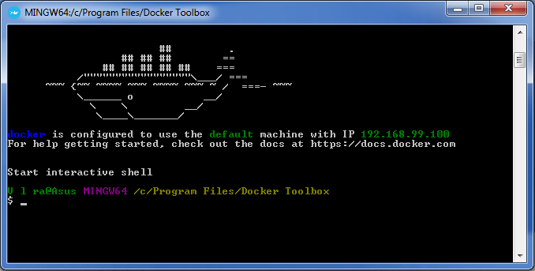
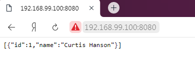

## Технологии

<ul>
    <li>Docker</li>
    <li>Spring Data JPA</li>
    <li>H2</li>
    <li>Spring Web</li>
    <li>Spring Boot</li>
    <li>Maven 3.6.1</li>
    <li>JDK 11 ver.</li>
</ul>

## Иллюстрации

 
 

## Описание приложения

<ul>
    <li><code>user-service</code> сервис с CRUD операциями User'а.</li>
    <li><code>docker</code> создание docker-контейнера.</li>
</ul>

## Порядок сборки
1 - Собрать Dockerfile:
<ul>
    <li><code>FROM: adoptopenjdk/openjdk11:jre-11.0.6_10-alpine</code> - Базовый, "голый" образ 
        jdk, который при сборки, скачивается с серверов хранилища образов, с так называемого "регистри" - <code>http://hub.docker.com</code>.</li>
    <li><code>VOLUME: /tmp</code> - Используется для сохранения данных, генеруемыми контейнером расположенном на Host'е.
        Также делит директрории из Host'а с контейнером. Инструкция VOLUME создает точку монтирования на контейнере с указанным путем.
        При запуске контейнера можно указать каталог в Host ОС, в который будет сопоставлена данная точка монтирования. 
        После этого все, что контейнер записывает в смонтированный путь, записывается в сопоставленный каталог на Host-ОС.                                                    
        В приведенном выше файле Dockerfile мы создали точку монтирования с помощью <code>path /tmp</code>, поскольку именно здесь приложение 
        spring boot по умолчанию создает рабочие каталоги для Tomcat.</li>
    <li><code>EXPOSE 8080</code> - Эта инструкция позволяет открыть определенный порт для внешнего мира.</li>
    <li><code>ARG JAR_FILE=target/demo-docker-0.0.1-SNAPSHOT.jar</code> - Инструкция ARG определяет переменную со значением по умолчанию.
        Вы можете переопределить значение переменной по умолчанию, передав его во время сборки.<code> ARG <имя>[=<дефолтные значения>].</code>
         После определения переменная может использоваться следующими за ней инструкциями.</li>
    <li><code>ADD:</code> - Инструкция ADD используется для копирования новых файлов и каталогов в образ docker.</li> 
    <li><code>ENTRYPOINT:</code> - Здесь вы настраиваете способ выполнения приложения внутри контейнера.</li>
    <li><code>CMD:,WORKDIR:,COPY:,LABEL:,ENV,...</code> - другие инструкции.</li>    
</ul>

2 - Собрать Docker-composer.yml
<ul>
    <li><code>version:</code> - версия сборки</li>
    <li><code>services:</code> - конфигурация контейнеров</li>
    <li><code>volumes:</code> - "расшаренная" папка на host'е, которую видят все контейнеры</li>
    <li><code>networks:</code> - сетевые настройки между host-container-container. Бывают несколько режимов:
        <code>bridge</code> -контейнеры могут общаться только в сети bridge, но не из других bridge-сетей.
        Коннект через IP. 
        <code>host</code> - сеть только через host, коннект идёт через порты.  
        <code>overlay</code> - нужен для объединения разных docker-машин. 
        <code>macvlan</code> - каждому контейнеру присваивается mac адрес, используется в legacy приложениях.
        <code>none</code> - нет никаких сетей</li>
</ul>

3 - Собрать spring-boot проект в jar файл.
<ul>
    <li><code>$ mvn clean install(или package)</code> после это появиться папка target, где и будет находиться
    .jar файл.</li>
</ul>

4 - Docker. Если у вас Docker Machine с Docker Quickstart Terminal, то надо запустить её.

5 - В консоли собрать image  docker-compose.
<ul>
    <li><code>$ docker-compose build</code> или <code>$ docker-compose up</code> . Начнётся создание образа и
    разворачивание контейнера(-ов) из того же образа, если выбран последний способ.</li>
</ul>

6 - Проверка.
<ul>
    <li> Если вы используете Docker для Linux, Docker Desktop для Mac или Docker Desktop для Windows,
    то теперь веб-приложение должно "смотреть" на порт <code>8080</code> на хосте Docker.
    Введите в своем веб-браузере адрес <code>http://localhost:8080</code>, чтобы увидеть сообщение работы приложения. 
    Если не сработает, вы также можете попробовать зайти на <code>http://127.0.0.1:8080</code>.           
    Если вы используете Docker Machine на Mac или Windows, используйте <code>ip MACHINE_VM docker-machine</code> для 
    получения IP-адреса вашего хоста Docker. Затем откройте <code>http://MACHINE_VM_IP:8080</code>
    (в нашем случае, исходя из фото <code>http://192.168.99.100:8080</code>) в браузере.
    </li>
</ul>

 

 

7 - Другие консольные команды.
<ul>
    <li><code>$ docker images</code> - показывает наличие образов.</li>
    <li><code>$ docker build -t название образа</code> - создание образа.</li>
    <li><code>$ docker run название-образа</code> - развёртывание из образа контейнер.</li>
    <li><code>$ docker run -p 8080:8080 название образа</code> - пуск образа с разворачиваем контейнера
        с явным выходом в браузер.</li>
    <li><code>$ docker-machine restart</code> - перезапуск docker машины.</li>
    <li><code>$ docker-machine start</code> - запуск docker машины.</li>
    <li><code>$ docker-machine stop</code> - остановка docker машины.</li>
    <li><code>$ docker login</code> - залогиниться в регистри (docker-hub)</li>
    <li><code>$ docker-compose build --build-arg baseimage="adoptopenjdk/openjdk11:jre11u-ubuntu-nightly"</code> - 
        создание образа с агрументами, после чего запустить этот образ <code>$ docker-compose up</code></li>
    <li><code>$ docker-compose up</code> - создание образа на основе docker-compose</li>
    <li><code>$ docker-compose stop</code> - остановить все контейнеры, которые недавно создались из образа</li>
    <li><code>$ docker tag e979458de489 valerakg/user-service:latest</code> - создание пространство имён для
        репозитории docker-hub</li>
    <li><code>$ docker push valerakg/user-service</code> - закачать образ на репозиторий docker-hub или др.</li>
    <li><code>$ docker rmi -f e979458de489</code> - удаление образа по id или по имени</li>
    <li><code>$ docker pull valerakg/user-service</code> - явно скачать образ из репозитории docker-hub или др.</li>
    <li><code>$ docker ps -a</code> - список, есть ли контейнеры.</li>
    <li><code>$ docker start имя-контейнера</code> - запуск контейнера</li>
    <li><code>$ docker stop имя-контейнера</code> - остановка контейнера</li>
    <li><code>$ docker restart имя-контейнера</code> - рестарт контейнера</li>
    <li><code>$ docker rm имя-контейнера</code> - удаление контейнера</li>
    <li><code>$ </code> - </li>
</ul>

##Взаимодействие с веб-службой

[localhost:8080](http://www.localhost:8080/ "www.localhost:8080/...")

